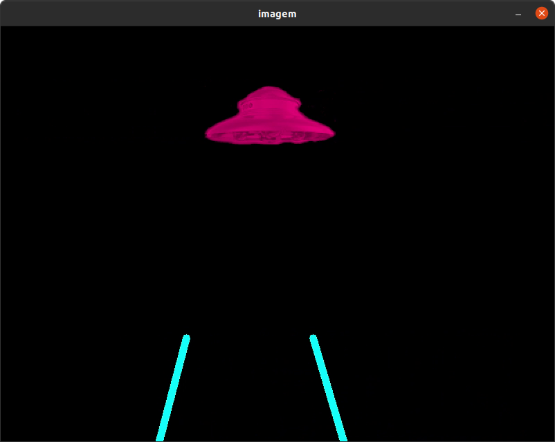
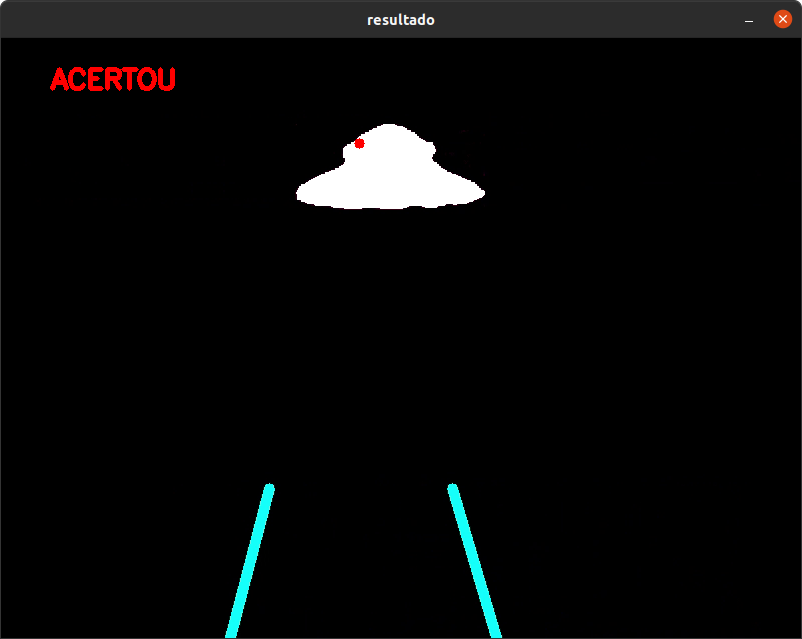
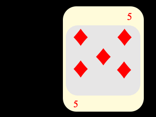
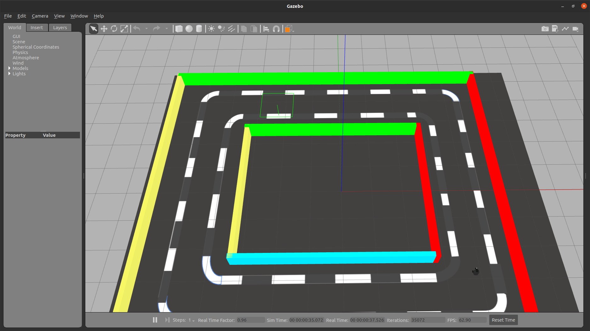
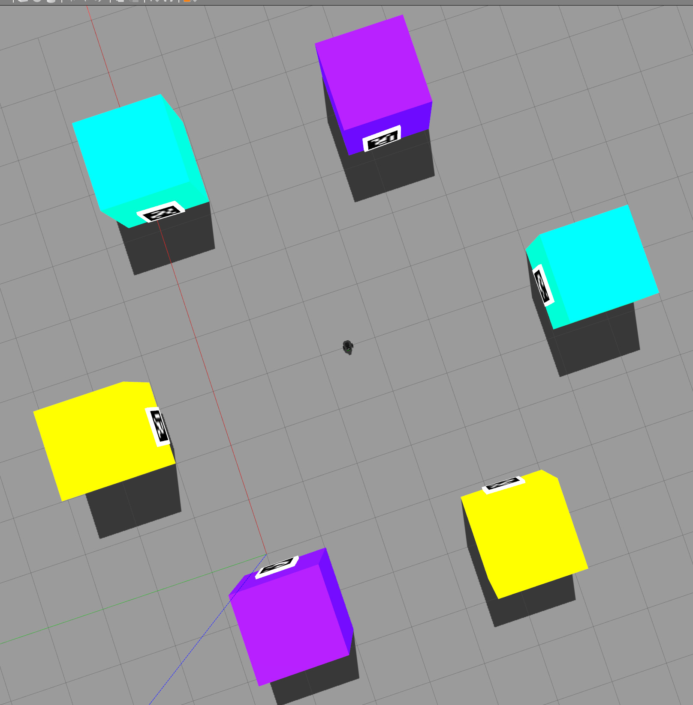

# Robótica Computacional 2021.2

## Avalilação Intermediária (P1)

**Indique seu nome e as questões que escolheu fazer logo abaixo. Você deve escolher 2 questões, para fazer em 2h.**

**No dia da prova, serão 3 questões paar responder em 4h.**

Nome:_______________

Questões que fez:____________

**Observações de avaliações nesta disciplina:**

* Clone o repositório da prova dentro de `~/catkin_ws/src` se estiver trabalhando no Linux.
* Você poderá dar quantos `git push` quiser no repositório, apenas o último será considerado.
* Antes de finalizar a prova verifique que os arquivos enviados ao github estão na sua última versão. É sua responsabilidade garantir isso.
* Inicie a prova no Blackboard para a ferramenta de Proctoring iniciar.
* Só finalize a prova no Blackboard após enviar a prova via Github classroom.
* Durante esta prova vamos registrar somente a tela, não a câmera nem microfone
* Ponha o nome no enunciado da prova no Github
* Tenha os repositórios https://github.com/Insper/robot21.2/ ,  https://github.com/arnaldojr/my_simulation e https://github.com/arnaldojr/mybot_description.git  atualizados em seu `catkin_ws/src`.
* Você pode consultar a internet ou qualquer material, mas não pode se comunicar com pessoas ou colegas a respeito da prova
* Todos os códigos fornecidos adicionalmente aos scripts em que as questões serão desenvolvidas foram testados em outro contexto, e são apenas um compilado. Não é obrigatório usar. Fique à vontade para modificar esse código e strazer outros arquivos que achar melhor. 
* Teste sempre seu código
* Entregue código que executa - código com erro que impede de executar implica em zero na questào
* Faça commits e pushes frequentes no seu repositório (tem dicas [no final deste arquivo](./instrucoes_setup.md))
* Esteja conectado no Teams e pronto para receber calls do professor e da equipe. 
* Avisos importantes serão dados no chat da prova no Teams - deixe o Teams aberto.
* Permite-se consultar qualquer material online ou próprio. Não se pode compartilhar informações com colegas durante a prova.
* Faça commits frequentes. Em caso de disputa sobre plágio, o primeiro a enviar alguma ideia será considerado autor original.
* A responsabilidade por ter o *setup* funcionando é de cada estudante.
* Questões de esclarecimento geral podem ser perguntadas no chat do Teams.
* Se você estiver em casa pode fazer pausas e falar com seus familiares, mas não pode receber ajuda na prova.
* É proibido colaborar ou pedir ajuda a colegas ou qualquer pessoa que conheça os assuntos avaliados nesta prova.
* Os exercícios admitem diversas estratégias de resolução. A prova de cada aluno é única. Atenha-se apenas à rubrica de cada questão.
* Se precisar reiniciar para alternar entre Linux e seu sistema nativo reinicie o Proctoring e avise o professor via chat. 

Existe algumas dicas de referência rápida de setup [instrucoes_setup.md](instrucoes_setup.md)

**Integridade Intelectual**

Se você tiver alguma evidência de fraude cometida nesta prova, [use este serviço de e-mail anônimo](https://www.guerrillamail.com/pt/compose)  para informar ao professor através do e-mail `antoniohps1@insper.edu.br`.

# Questões

## Questão 1  (3.33 pontos)

Você faz parte da equipe de desenvolvimento de um remake do jogo Space Invaders, em que será usado um canhão de sobreposição de radiação para evitar que a nave alienígena aterrisse. Neste tipo de arma, os feixes de raios X emitidos em linha reta por dois braços emissores atingem seu potencial destrutivo no ponto em que se encontram.

Você precisa desenvolver um programa que avalia uma determinada situação do jogo.

Regras:

* O ponto de confluência dos raios X devem ser marcados com um pequeno círculo vermelho.

* Caso os feixes se encontrem sobre a nave alienígena, ela deve ser toda pintada de branco e o texto `ACERTOU` deve ser mostrado na imagem E no terminal. Porém você não deve terminar o jogo.

* Caso a parte de baixo da nave alienígena atinja a mesma altura dos braços do canhão, o fundo da tela deve ser pintado de amarelo (RGB=(255,255,0))e o texto `CUIDADO` deve ser mostrado no terminal.

* Caso a nave alienígena encostar em pelo menos um dos braços do canhão, o texto `GAME OVER` deve ser mostrado na tela e no terminal. Isso deve se manter até o fim do vídeo, ou seja, o texto não poderá ser mais retirado da imagem, e deve ser mostrado repetidamente no terminal.

*Exemplo de situação onde o canhão acertou a nave*

Estado do jogo (imagem de entrada)

Como deve ficar a tela (imagem de saída)

#### Orientações

Trabalhe no arquivo `q1/q1.py`. Este exercício **não precisa** de ROS. Portanto pode ser feito até em Mac ou Windows

Você vai notar que este programa roda o vídeo `lasercannon.mp4`. Baixe o vídeo [neste endereço](https://drive.google.com/file/d/1n7JRLZzbN8YZDxTZS0tli8v_RpNzZUAc/view?usp=sharing), dentro da pasta `q1/`.

#### O que você deve fazer:

|Resultado| Conceito| 
|---|---|
| Não executa | zero |
| Segmenta ou filtra a imagem baseado em cores ou canais da imagem e produz output visual| 0.6|
| Identifica o ponto de confluência corretamente, com output bem claro OU identifica que a nave atinge a altura perigosa| 1.3|
| Identifica ambas as situações acima| 2.1 |
| Identifica as três situações pedidas no enunciado, mas não está perfeito | 2.8 |
| Resultados perfeitos | 3.33|

Casos intermediários ou omissos da rubrica serão decididos pelo professor.

## Questão 2 (3.3 pontos)

Você vai começar a fazer um programa capaz de dizer qual carta de um baralho está sendo apresentada.

Seu objetivo é apontar o valor (ex.: "6")  e o naipe da carta appresentada a cada frame (ex.: Ouros)

#### Orientações

A análise precisa levar em conta a imagem. Não pode levar em conta somente os tempos.

Você vai precisar do arquivo `cartas.mp4` para resolver a questão.

Todas as cartas com naipes vermelhos são de ouros

Todas as cartas com naipes pretos são de paus

Baixe os arquivos de vídeo [neste link](https://github.com/Insper/robot20/raw/master/media/cartas.mp4)

#### O que você deve fazer:

Seu programa deve analisar a imagem e produzir uma saída indicando qual o naipe e qual o número. Ex.: `5 DE PAUS`, `6 DE OUROS` , etc. Seu programa só precisa funcionar para este vídeo específico, não será testado com outros vídeos em que apareçam cartas em outras posições.

O apontamento não precisa ser feito na tela, pode ser feito no terminal.

|Resultado| Conceito| 
|---|---|
| Não executa | 0 |
| Faz separação por cores dos marcadores de naipes  | 1.0 |
| Procura separar cada uma das regiões de paus ou ouros para contar quantas são, mas não acerta  | 2.3 |
| Funciona perfeitamente | 3.33 | 

Casos intermediários ou omissos da rubrica serão decididos pelo professor.

[Fonte dos arquivos](https://commons.wikimedia.org/wiki/File:Anglo-American_card_suits.svg)

## Questões de ROS

**Atenção: ** 

Para fazer estra questão você precisa ter o `my_simulation` e o `mybot_description` atualizado.

    cd ~/catkin_ws/src
    cd my_simulation
    git stash
    git pull

Ou então se ainda não tiver:

    cd ~/catkin_ws/src
    git clone https://github.com/arnaldojr/my_simulation.git

Para o mybot_description:

    cd ~/catkin_ws/src
    cd mybot_description
    git stash
    git pull

Ou então se ainda não tiver:

    cd ~/catkin_ws/src
    git clone https://github.com/arnaldojr/mybot_description

Em seguida faça o [catkin_make](./instrucoes_setup.md). 

## Questão 3 (3.33 pontos)

</img>

Seu robô está no cenário visível abaixo:

    roslaunch my_simulation quarto.launch

#### O que é para fazer

Faça o robô dar uma volta no corredor quadrado, evitando de sair pela região delimitada pelas linhas tracejadas, parando próximo ao ponte de partida e medindo a distância percorrida pelo robô. A distância atual deve ser impressa no terminal.

Sensores que você pode usar: 
* Camera
* Laser 
* Odometria

**Importante:** nem todos os sensores precisam ser usados o tempo todo. Assim, se a câmera e o laser forem usados eventualmente serão considderados como dois sensores.

#### Detalhes de como rodar

O código para este exercício está em: `sim3_212/scripts/q3.py`

Para rodar, recomendamos que faça:

    roslaunch my_simulation quarto.launch

Depois:

    rosrun sim3_212 q3.py

|Resultado| Conceito| 
|---|---|
| Não executa | 0 |
| Faz o robô chegar ao fim em malha aberta - só com velocidades e tempos| 0.5 |
| Usa a câmera ou o laser para alinhar o robô e finalizar a volta | 1.5 |
| Além da rubrica acima, o robô não ultrapassa os limites das linhas tracejadas | 2.0 |
| Usa a câmera para centralizar o robô no meio da pista | 2.83|
| Mede a distância percorrida | +0.5|

Casos intermediários ou omissos da rubrica serão decididos pelo professor.

## Questão 4

Para executar o cenário, faça:

    roslaunch my_simulation encaixotado.launch 

O código para este exercício está em: `sim3_212/scripts/q4.py`

Seu robô está num cenário como o que pode ser visto na figura: 

#### O que é para fazer

Faça o robô girar até encontrar a caixa **roxa** que tem o ID Aruco 61.

Depois que o robô encontrar e centralizar a visão na caixa mencionada acima, ele precisa começar a se deslocar em direção à caixa

Deve parar, guiado pelo laser, a uma distância de 70 cm da caixa. 

Depois o seu código:

    rosrun sim3_212 q4.py

|Resultado| Conceito| 
|---|---|
| Não executa | 0 |
| Robô gira| 0.2|
| Segmenta caixas roxas e vai além da máscara de pixels | 0.75|
| Para na caixa roxa | 1.0|
| Identifica e mostra ids ARUCO | 1.5 |
| Centraliza na caixa roxa com id 61  | 2.0|
| Para a $70cm$ da caixa roxa id 61  | 2.5|

Casos intermediários ou omissos da rubrica serão decididos pelo professor.

**Boa sorte!!**
